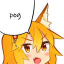

# PogMe &middot;  ](https://www.npmjs.com/package/discord.js)  

A kewl discord bot written in [d.js](https://discord.js.org/).

## Getting started

You can invite **PogMe** to your server by using this [discord invite link](https://discord.com/api/oauth2/authorize?client_id=700428283443019846&permissions=388160&redirect_uri=https%3A%2F%2Fdiscord.com%2Finvite%2FvKWe7ymUJq&scope=bot).
If you want to change few things & host it yourself, follow the [installation guide](#installation)!

## Installation

Make sure, that you have `git`, `node` and `npm` installed

Clone the repo using

    git clone https://github.com/mattcapazz/PogMe.git

Install all dependencies using

    npm i

Start the bot using

    npm start

You can keep your bot up to date by using

    git pull && npm install

## Contributing

All [contributions](CONTRIBUTING.md) are welcome! Please read the contributing guidelines before getting started.

## License

[MIT](LICENSE), _meaning you can pretty much do whatever you want with this_.
